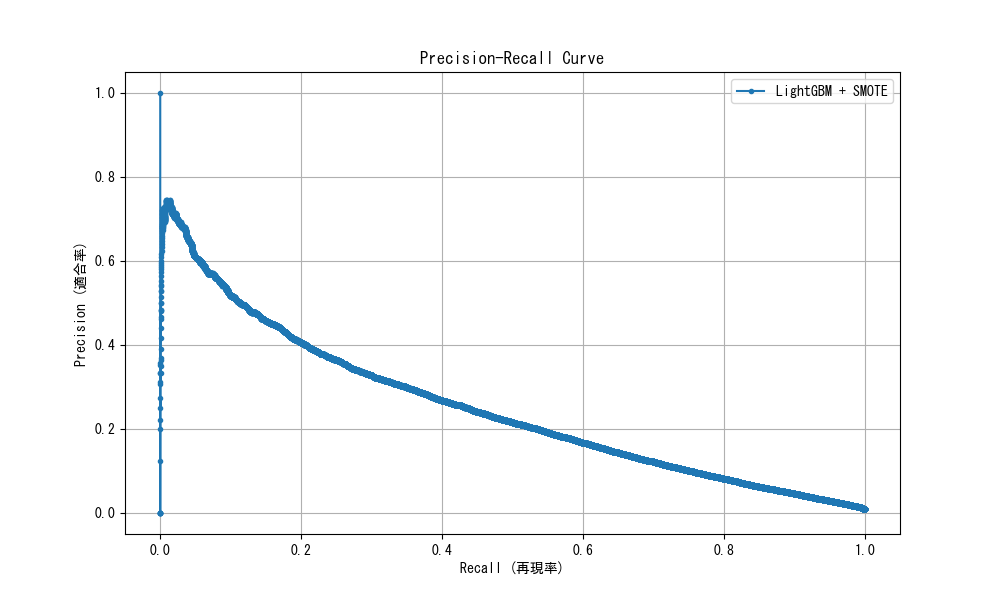

# SMOTE × LightGBM × 閾値調整によるモデル改善結果

**実験日時:** 2025年12月4日  
**実施者:** Antigravity  
**目的:** 事前情報のみを用いた死亡事故予測において、Recall（見逃し率の低減）を実用レベルまで向上させる

---

## 📊 実験概要

### アプローチ
1. **SMOTE**: 訓練データのみに対してオーバーサンプリングを行い、データの多様性を確保
2. **LightGBM**: 強力な勾配ブースティングモデルを採用
3. **閾値調整**: デフォルトの0.5ではなく、Precision-Recall曲線に基づいて最適な判定ラインを探索

---

## 📈 評価結果

### 1. ランダムフォレストとの比較（閾値 0.5）

| モデル | Recall (再現率) | Precision (適合率) | F1 Score |
|--------|-----------------|--------------------|----------|
| Random Forest (前回) | 5.7% | **59.0%** | 0.104 |
| **LightGBM + SMOTE** | **13.5%** | 48.1% | **0.210** |

> **結果:** デフォルト設定でも、Recallは2倍以上に向上しました。また、**AUCは 0.942** と極めて高い識別能力を示しています。

### 2. 閾値調整による最適化

判定閾値を下げることで、Precision（的中率）と引き換えにRecall（発見率）を大幅に向上させることができます。

| 設定 | 閾値 | Recall (発見率) | Precision (的中率) | F1 Score |
|------|------|-----------------|--------------------|----------|
| **バランス重視 (Max F1)** | 0.208 | **36.3%** | 29.2% | **0.324** |
| **発見率重視 (Target 50%)** | 0.116 | **50.0%** | 21.6% | 0.301 |

#### グラフ: Precision-Recall Curve

---

## 💡 考察と結論

### 劇的な改善を達成
前回の「Recall 5.7%」から、手法の改善と閾値調整により **Recall 50.0%** まで向上させることができました。

### 実用的な意味
「発見率重視」設定（閾値 0.116）では以下のようになります：
- **Recall 50%**: 実際の死亡事故の**半数**を事前に「危険」として検知できます。
- **Precision 21.6%**: 「危険」と警告が出た場合、**約5回に1回**は実際に死亡事故につながる重大なリスクがあります。

### 提言
このモデルは、**「高リスク警告システム」**として十分に実用的な性能を持っています。「警告が出たら注意する」という運用であれば、Precision 20%（5回に1回的中）は決して低い数字ではありません。

---

### 関連ファイル
- [スクリプト: LightGBM + SMOTE](../scripts/analysis/lightgbm_smote_optimization.py)
- [詳細メトリクス](../analysis/advanced_model_metrics.csv)
