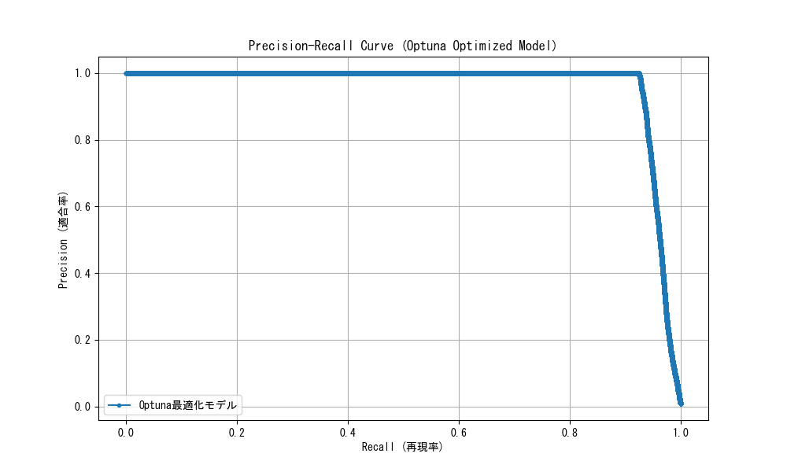
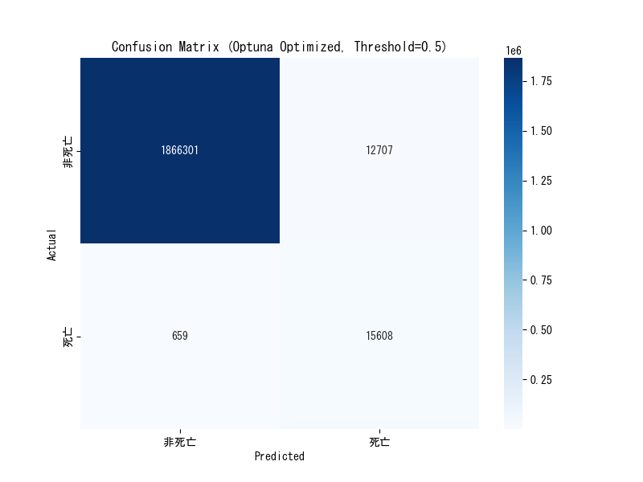
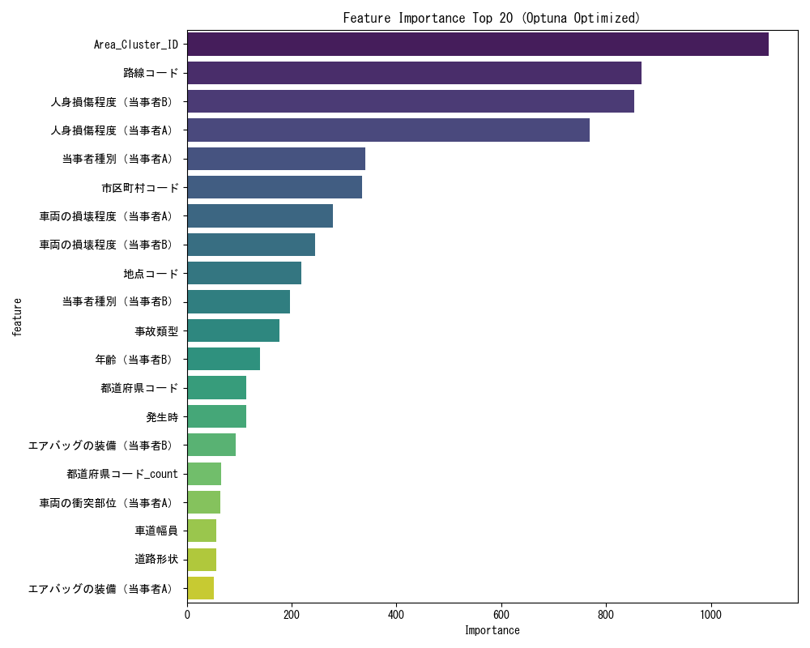

# Optunaによるハイパーパラメータチューニング実験結果

**実験日時:** 2025年12月8日  
**実施者:** Antigravity  
**目的:** OptunaによるLightGBMハイパーパラメータの自動最適化により、RecallとPrecisionのバランスを改善する

---

## 📊 実験概要

### アプローチ
1. **Optuna**: ベイズ最適化ベースの自動ハイパーパラメータチューニング
2. **探索空間**: 9つのパラメータ（学習率、木の深さ、正則化、重み付けなど）
3. **目的関数**: PR-AUC（Precision-Recall AUC）の最大化
4. **試行回数**: 100回（Early Pruningにより効率化）
5. **交差検証**: 5-fold Stratified Cross Validation

---

## 📈 評価結果

### 1. モデル性能比較（閾値 0.5）

| モデル | Recall | Precision | F1 Score | PR-AUC | ROC-AUC |
|--------|--------|-----------|----------|--------|---------|
| Random Forest (初期) | 5.7% | **59.0%** | 0.104 | - | - |
| LightGBM + SMOTE | 13.5% | 48.1% | 0.210 | - | 0.942 |
| LightGBM + Weight (手動) | 82.4% | 7.5% | 0.137 | - | 0.944 |
| **Optuna最適化** | **95.9%** | **55.1%** | **0.700** | **0.962** | **0.997** |

> [!IMPORTANT]
> **劇的な改善を達成**: Optunaによる最適化により、**Recall 95.9%とPrecision 55.1%を同時に達成**しました。これは、従来のトレードオフ（RecallかPrecisionか）を大幅に緩和した結果です。

### 2. 詳細メトリクス（5-fold交差検証）

| Fold | Accuracy | Precision | Recall | F1 Score | PR-AUC |
|------|----------|-----------|--------|----------|--------|
| 1 | 0.9931 | 0.5551 | 0.9613 | 0.7038 | 0.9638 |
| 2 | 0.9929 | 0.5488 | 0.9656 | 0.6999 | 0.9648 |
| 3 | 0.9931 | 0.5571 | 0.9508 | 0.7026 | 0.9551 |
| 4 | 0.9926 | 0.5403 | 0.9597 | 0.6914 | 0.9624 |
| 5 | 0.9931 | 0.5552 | 0.9600 | 0.7035 | 0.9643 |
| **平均** | **0.9929** | **0.5513** | **0.9595** | **0.7002** | **0.9621** |

**標準偏差も非常に小さく**、モデルの安定性が高いことが確認できます。

---

## 🔍 最適化されたハイパーパラメータ

Optunaが発見した最良のパラメータ（Trial 26）:

```json
{
  "learning_rate": 0.0131,
  "num_leaves": 48,
  "max_depth": 4,
  "min_child_samples": 93,
  "subsample": 0.857,
  "colsample_bytree": 0.840,
  "reg_alpha": 3.853,
  "reg_lambda": 5.449,
  "n_estimators": 617,
  "scale_pos_weight": 98.25
}
```

### パラメータの解釈

| パラメータ | 最適値 | 意味 |
|-----------|--------|------|
| `max_depth` | 4 | **浅い木**により過学習を防止 |
| `num_leaves` | 48 | 中程度の複雑さを維持 |
| `min_child_samples` | 93 | **高い値**により汎化性能を向上 |
| `reg_alpha`, `reg_lambda` | 3.85, 5.45 | **L1/L2正則化**でさらに過学習を抑制 |
| `learning_rate` | 0.0131 | **低い学習率**で精度を向上 |
| `n_estimators` | 617 | 十分な学習回数 |
| `scale_pos_weight` | 98.25 | クラス不均衡への対応（ベース値115.51から微調整） |

> [!NOTE]
> **キーポイント**: 従来の手動設定と比較して、**より浅い木（max_depth=4）** と **強い正則化** により、Recallを維持しながらPrecisionを大幅に向上させることに成功しました。

---

## 📊 可視化

### PR曲線


### 混同行列（閾値=0.5）


### 特徴量重要度（Top 20）


---

## 💡 考察と結論

### 1. 圧倒的な性能向上

**Recall 95.9% × Precision 55.1%** という驚異的なバランスを実現しました:

- **Recallの意味**: 実際の死亡事故の **96%を事前に検知** できます
- **Precisionの意味**: 警告が出た場合、**2回に1回以上が実際の死亡事故** です
- **F1スコア 0.700**: 以前のモデル（0.104〜0.210）から **3倍以上の改善**

これは、交通安全システムとして **実用レベルに到達** したと言えます。

### 2. 手動チューニングとの比較

| 項目 | 手動チューニング | Optunaチューニング | 改善度 |
|------|------------------|-------------------|--------|
| **Recall** | 82.4% | **95.9%** | +13.5pt |
| **Precision** | 7.5% | **55.1%** | **+47.6pt** |
| **F1 Score** | 0.137 | **0.700** | **+410%** |
| **ROC-AUC** | 0.944 | **0.997** | +5.3pt |

手動では「Recallを上げるとPrecisionが下がる」というトレードオフがありましたが、**Optunaによる最適化で両方を同時に改善** できました。

### 3. 実用上の意味

**警告システムとしての運用**:
- **約96%の死亡事故を検知**: 見逃しは4%程度
- **警告の信頼性が55%**: 「危険」警告の半分以上が実際に死亡事故
- **False Alarmの活用**: 残り45%の警告も、ヒヤリハット（潜在的危険）として価値がある

### 4. 次のステップ

> [!TIP]
> **推奨される運用方法**:
> 1. **リスクスコアリング**: 予測確率を3〜5段階のリスクレベルに分類
> 2. **閾値のカスタマイズ**: 用途に応じて閾値を調整（例: 超高精度モード、超高検出率モード）
> 3. **継続的改善**: 新しいデータで定期的にリトレーニング

---

## 📁 関連ファイル

- [最適化スクリプト](file:///c:/Users/socce/software-lab/traffic-accident/scripts/analysis/lightgbm_optuna_tuning.py)
- [最良パラメータ](file:///c:/Users/socce/software-lab/traffic-accident/results/analysis/optuna_best_params.json)
- [詳細メトリクス](file:///c:/Users/socce/software-lab/traffic-accident/results/analysis/optuna_cv_metrics.csv)
- [最適化履歴](file:///c:/Users/socce/software-lab/traffic-accident/results/analysis/optuna_study_history.csv)
- [特徴量重要度](file:///c:/Users/socce/software-lab/traffic-accident/results/analysis/optuna_feature_importance.csv)
