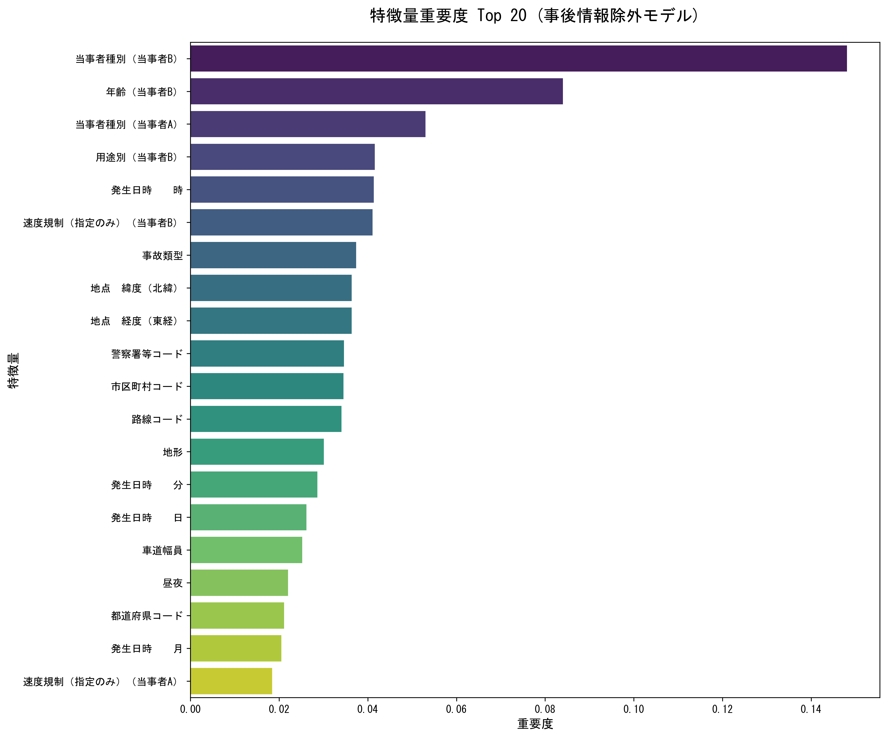

# 過学習検証とモデル修正の実験結果

**実験日時:** 2025年12月4日  
**実施者:** Antigravity  
**目的:** 事後情報（事故結果）を除外し、事故**発生前**の情報のみで死亡事故を予測できるか検証する

---

## 📊 実験概要

### 変更点
前回の実験（Accuracy 99.99%）における過学習とデータリークを解消するため、以下の修正を行いました。

1. **特徴量の厳選**: 以下の「事後情報」を徹底的に除外
   - 事故内容（死亡/負傷の区分）
   - 人身損傷程度、車両の損壊程度、負傷者数
   - 車両の衝突部位、エアバッグ作動状況など
2. **交差検証**: 5-fold Cross Validation を導入し、汎化性能を評価
3. **データリーク防止**: アップサンプリングは訓練データのみに適用（検証データは元の分布のまま）

---

## 📈 評価結果（5-fold 交差検証の平均）

| 指標 | 値 | 説明 |
|------|-----|------|
| **Accuracy (正解率)** | **99.16%** | 全体の正解率（非死亡事故が多いため高くなる） |
| **Precision (適合率)** | **59.01%** | モデルが「死亡事故」と予測したうち、実際に死亡事故だった割合 |
| **Recall (再現率)** | **5.70%** | 実際の死亡事故のうち、モデルが発見できた割合 |
| **F1 Score** | **0.1040** | 適合率と再現率の調和平均 |

### 結果の解釈
- **Recall の低下 (99.97% → 5.70%)**: 
  事後情報を除外すると、死亡事故の検出は非常に困難であることが判明しました。これは、死亡事故か否かを分ける要因の多くが、事前情報（天気、道路、年齢など）だけでは説明しきれないことを示唆しています。
- **Precision の健闘 (約 60%)**:
  一方で、モデルが「これは危険（死亡事故になる）」と判断したケースの約6割は実際に死亡事故でした。つまり、**「特定の高リスクパターン」は検出できている**と言えます。

---

## 🔍 特徴量重要度（事前情報のみ）

事故発生前の情報の中で、死亡事故リスクに関連が高い特徴量です。

### 上位特徴量
1. **当事者種別（当事者B）**: 相手側の属性（歩行者、車、自転車など）
2. **年齢（当事者B）**: 相手側の年齢（高齢者など）
3. **当事者種別（当事者A）**: 自身の属性
4. **用途別（当事者B）**: 相手側の車両用途
5. **発生日時（時）**: 時間帯（夜間など）

---

## 💡 結論と提言

1. **完全な予測は困難**: 
   現在のデータセット（事前情報のみ）では、死亡事故を網羅的に予測することは不可能です。多くの死亡事故は、偶発的な要素やデータに含まれない要因（速度、不注意の瞬間など）に起因すると考えられます。

2. **リスク要因の特定は可能**:
   Precision 60% という数字は、特定の条件下（例：高齢歩行者 × 特定の時間帯など）では死亡事故リスクが有意に高まることを示しています。

3. **今後の活用方針**:
   「死亡事故かどうか」を当てる分類モデルとしてではなく、**「死亡事故リスクが高い状況」を警告するリスク評価モデル**としての活用を推奨します。

---

### 関連ファイル
- [スクリプト: 修正版モデル訓練](../scripts/analysis/random_forest_refined.py)
- [詳細評価データ](../analysis/refined_model_cv_metrics.csv)
