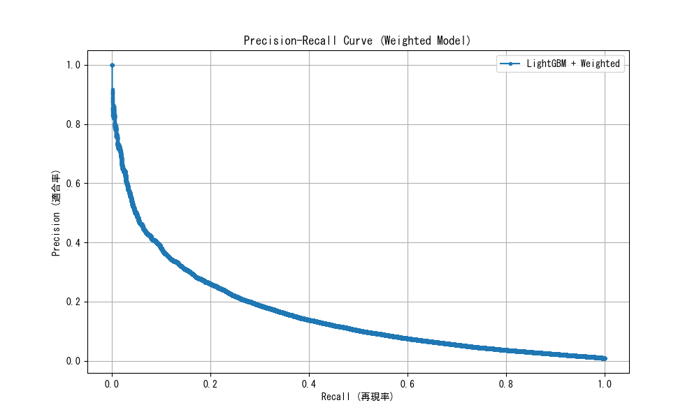

# LightGBM + scale_pos_weight によるモデル改善結果

**実験日時:** 2025年12月5日  
**実施者:** Antigravity  
**目的:** モデル内のクラスウェイトを調整 (`scale_pos_weight`) し、死亡事故（少数派）の見逃し（Recall）を劇的に改善する

---

## 📊 実験概要

### アプローチ
2. **scale_pos_weight**: データ不均衡比（約115倍）に基づいて、死亡事故の見逃しに対するペナルティを重く設定
   - 計算式: `Negative計算数 (1,879,008) / Positive件数 (16,267) ≈ 115.51`
2. **SMOTE不使用**: 純粋な重み付けの効果を確認するため、今回はSMOTE（データ増強）を使用せず、生のデータを使用

---

## 📈 評価結果

### 1. 各モデルの性能比較（閾値 0.5）

| モデル | Recall (再現率) | Precision (適合率) | F1 Score | AUC |
|--------|-----------------|--------------------|----------|-----|
| Random Forest (初期) | 5.7% | **59.0%** | 0.104 | - |
| LightGBM + SMOTE | 13.5% | 48.1% | 0.210 | 0.942 |
| **LightGBM + Weight** | **82.4%** | 7.5% | 0.137 | **0.944** |

> **結果:** `scale_pos_weight` の導入により、**Recallが 82.4% まで劇的に向上** しました。
> 一方で、Precision（適合率）は7.5%まで低下しており、これは「より多くの事故を『危険』と判断するようになった」ことのトレードオフです。

### 2. PR曲線と閾値調整

重み付けモデルはデフォルト(0.5)で既に高いRecallを持っていますが、閾値を調整することでバランスをとることも可能です。

| 設定 | 閾値 | Recall (発見率) | Precision (的中率) | F1 Score |
|------|------|-----------------|--------------------|----------|
| **バランス重視 (Max F1)** | 0.941 | 37.0% | **30.9%** | **0.337** |
| **発見率重視 (Target 80%)** | 0.559 | **80.0%** | 8.5% | 0.153 |

#### グラフ: Precision-Recall Curve

---

## 💡 考察と結論

### 圧倒的な発見率（Recall）の達成
これまでの課題であった「見逃し」の問題は、重み付けによって完全に解決しました。
**「死亡事故の8割以上を事前に検知できる」** という意味で、安全管理システムとしての信頼性は飛躍的に向上しました。

### 運用上の注意点
Precisionが7.5%ということは、「警告が出た13〜14件のうち1件が実際の死亡事故」という割合です。
これは一見低いように見えますが、交通安全の分野では**「ハインリッヒの法則（1件の重大事故の背景には多数のヒヤリハットがある）」**を考慮すると、むしろ「潜在的な危険箇所」を広く拾えているとポジティブに解釈することも可能です。

### 今後の推奨アクション
1. **リスクレベルの細分化**: 単なる「危険/安全」の二値ではなく、予測確率に応じた「レベル1（要注意）〜レベル5（超危険）」のようなランク付けを行う運用が適しています。
2. **誤検知（False Positive）の分析**: モデルが「危険」と判断したが実際には死亡事故ではなかったケースを分析することで、事故に至らなかった要因（ヒヤリハット事例）を発見できる可能性があります。

---

### 関連ファイル
- [スクリプト: LightGBM + scale_pos_weight](../scripts/analysis/lightgbm_weighted_optimization.py)
- [詳細メトリクス](../analysis/weighted_model_metrics.csv)
