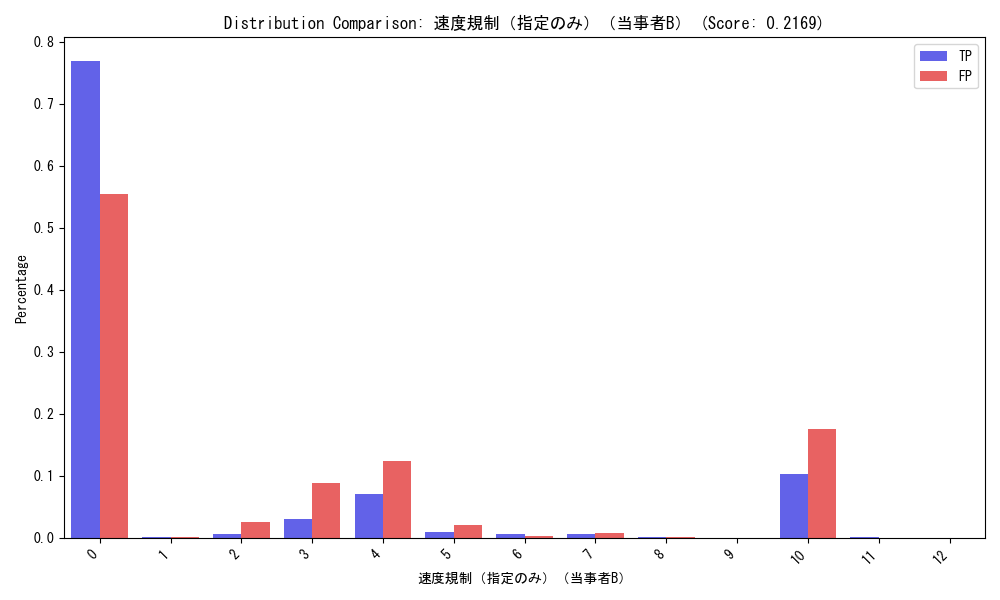
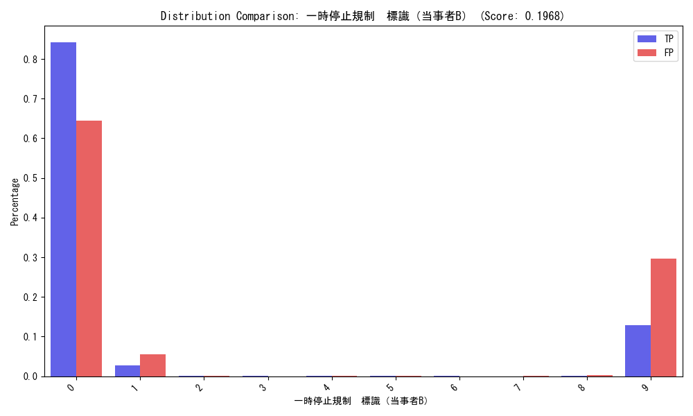
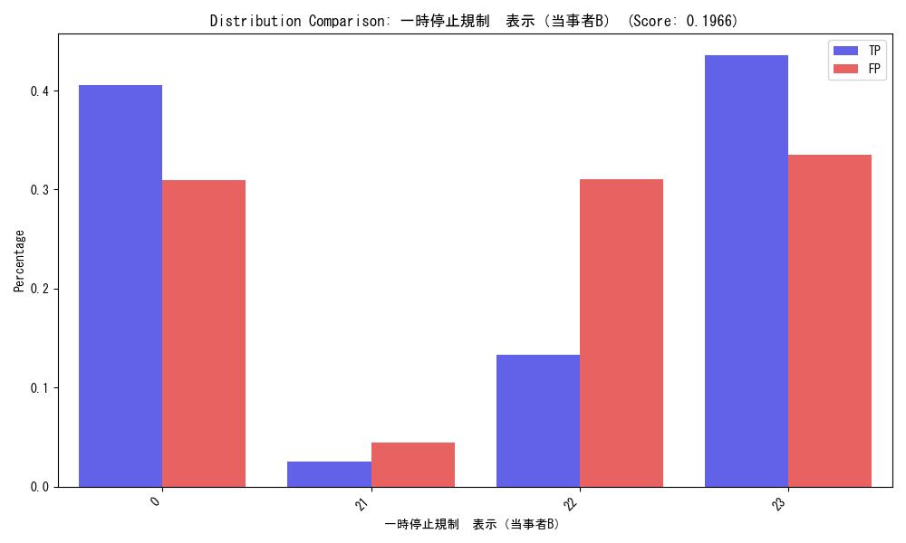
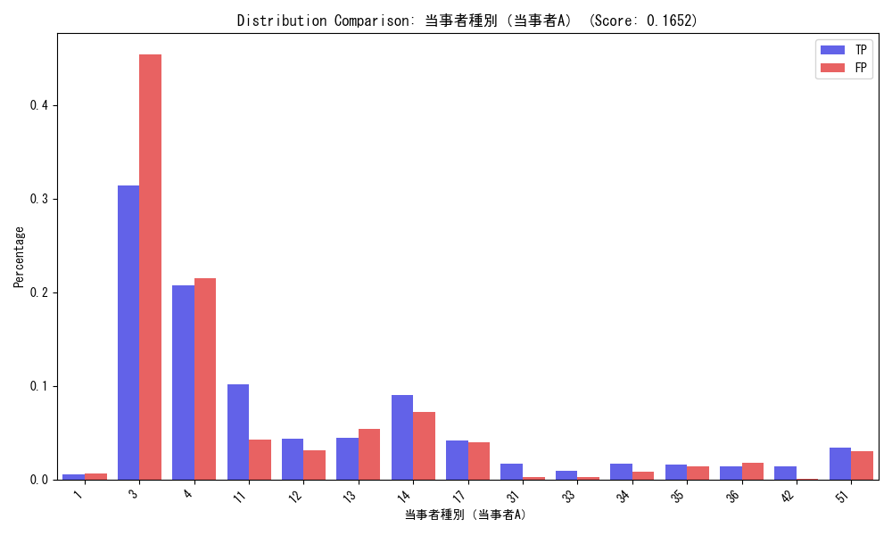
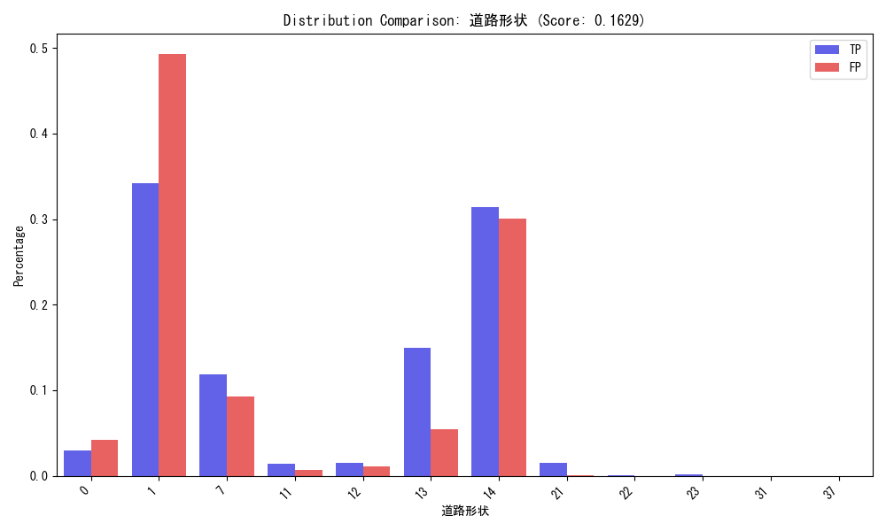
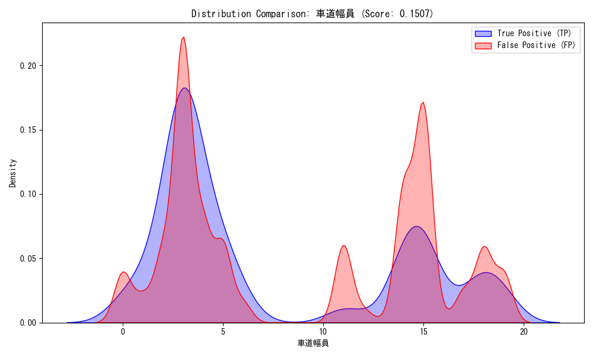

# TP vs FP: 特徴量分布の比較分析 (Visual Summary)

本レポートは、モデルが**「正しく死亡事故と判定できたケース (TP)」**と**「死亡事故ではないのに死亡事故と誤判定したケース (FP)」**の違いを可視化したものです。
どの特徴量が誤検知（FP）に強く影響しているかを理解するのに役立ちます。

> [!NOTE]
> **用語の定義**
> - **TP (True Positive)**: 実際の死亡事故を、正しく「危険」と予測できた群（青色）
> - **FP (False Positive)**: 重傷・軽傷事故なのに、「危険（死亡事故）」と過大評価された群（赤色）
> - **分布の乖離**: 青と赤の棒グラフや分布が**ズレている**ほど、その特徴量がモデルの判定（および誤判定）に大きく寄与している可能性を示唆します。

---

## 📊 分布乖離度ランキング Top 10

「特徴量の分布がどれだけTPとFPで異なっているか」をスコア化しました（最大1.0）。
正答ラベルである「死者数」を除くと、**相手車両（当事者B）の規制状況**や**道路環境**が上位に来ています。

| Rank | 特徴量名 | 乖離スコア | 解釈のヒント |
| :--- | :--- | :--- | :--- |
| **1** | **速度規制（指定のみ）（当事者B）** | **0.217** | 相手車両側の速度制限の違いが、事故の重大性予測に強く影響しています。 |
| **2** | **一時停止規制 標識（当事者B）** | **0.197** | 相手側の一時停止無視などが、死亡判定（TP）または誤判定（FP）の要因の1つと考えられます。 |
| **3** | **一時停止規制 表示（当事者B）** | **0.197** | 同上。標識と表示は相関が高いため、同様の結果となっています。 |
| **4** | **当事者種別（当事者A）** | **0.165** | 自身の属性（乗用車、高齢者、二輪車など）による違い。 |
| **5** | **道路形状** | **0.163** | 交差点か単路かなど。死亡事故特有の発生場所があることを示唆します。 |
| **6** | **昼夜** | **0.157** | 夜間の事故は死亡率が高くなる傾向があり、モデルもそれを学習しています。 |
| **7** | **地形** | **0.154** | 平坦、坂道などの地形的要因。 |
| **8** | **衝突地点** | **0.153** | 事故が起きた具体的な地点タイプ。 |
| **9** | **車道幅員** | **0.151** |  |
| **10** | **一時停止規制 標識（当事者A）** | **0.1501** | 自分側の一時停止規制も影響。 |

※ 「死者数」は正解ラベルそのものなので除外しています。

---

## 📈 主要特徴量の分布詳細

特に差が大きい特徴量について、実際の分布グラフを表示します。
**青色（実線/棒）がTP**、**赤色（破線/棒）がFP**です。

### 1. 速度規制（指定のみ）（当事者B）
相手方の道路の速度規制値です。
TP（死亡）では特定の規制値の割合が高い可能性があります。



### 2. 一時停止規制（当事者B）
相手側の一時停止規制の有無です。
「規制あり」の場合の挙動が、重大事故の予測キーになっている可能性があります。

````carousel

> **一時停止規制（標識）**
<!-- slide -->

> **一時停止規制（表示）**
````

### 3. 当事者種別（当事者A）
自分自身の属性（乗用車、貨物、二輪など）です。
車種による死亡リスクの違いが反映されています。



### 4. 道路環境（形状・地形）
どのような道路で事故が起きたか。
交差点内やカーブなど、特定の形状でTP/FPの傾向が分かれています。

````carousel

> **道路形状**
<!-- slide -->

> **地形**
````

### 5. 時間帯（昼夜）
夜間の事故は視認性が悪く、重大事故につながりやすい傾向があります。
モデルも「夜間」を死亡フラグとして強く学習しているため、夜間の軽微な事故をFPとして拾っている可能性があります。


### 6. 車道幅員
数値データとしての分布比較です。
道路の広さがスピードの出しやすさや事故タイプに関連していると考えられます。



---

## 💡 考察と次のステップ

**FP（誤検知）を減らすには？**

1.  **「当事者B（相手方）」情報の精査**:
    - 上位に相手方の規制情報が多くランクインしています。これは「相手が一時停止無視をしそうな交差点」などをモデルが「危険」と判断している証拠です。
    - しかし、実際には死亡に至らなかった（FP）ケースでも、これらの条件が揃っていることが多いようです。「危険な状況だが、運良く助かった」ケースをFPとして拾っている可能性があります。
    - これらを区別するには、**「衝突の激しさ（相対速度など）」**の情報が必要かもしれません（データにあれば）。

2.  **状況特異的な閾値調整**:
    - 「夜間」「交差点」など、モデルが過剰に反応しやすい条件下では、判定閾値を少し厳しくする（高くする）などの調整が有効かもしれません。

3.  **質的分析**:
    - `results/analysis/fp_tp_export/fp_recall_0.99_thresh_0_0177.csv` の中身を個別に見て、例えば「速度規制がない場所でのFP事例」などを具体的に確認することをお勧めします。
