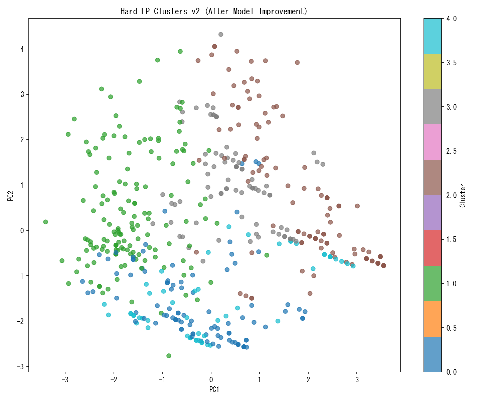

# Hard FP Re-Profiling Report (v2)

## 概要
モデル改善後の残存FPを再分析した結果を報告する。

- **分析対象**: 予測確率上位 500 件のFP
- **予測確率範囲**: 0.0724 - 0.0816

## 1. Cluster 0 消滅チェック

> [!WARNING]
> **⚠️ 警告**: 前回の主犯格パターンは依然として残っています。

### 前回 vs 今回の比較（割合変化評価）
| Feature | 前回値 | 前回割合 | 今回値 | 今回割合 | Status |
| :--- | :--- | :--- | :--- | :--- | :--- |
| 昼夜 | 22 | 75% | 22 | 42.4% | ✅ Reduced (75% → 42.4%) |
| 地形 | 1 | 72% | 1 | 37.8% | ✅ Reduced (72% → 37.8%) |
| 道路形状 | 14 | 44% | 14 | 33.4% | ⚠️ Still Dominant (44% → 33.4%) |
| 当事者種別（当事者A） | 3 | 57% | 51 | 27.4% | ✅ Disappeared (Type Change) |

## 2. 新たな強敵パターン

| Feature   |   Dominant_Value | Percentage   | Warning      |
|:----------|-----------------:|:-------------|:-------------|
| 天候        |                1 | 71.2%        | ⚠️ NEW ENEMY |

## 3. クラスタ分析

|   Cluster |   Count |   Avg_Prob |   道路形状_mode | 道路形状_pct   |   昼夜_mode | 昼夜_pct   |   天候_mode | 天候_pct   |   地形_mode | 地形_pct   |   当事者種別（当事者A）_mode | 当事者種別（当事者A）_pct   |   年齢（当事者A）_mean |   speed_reg_diff_abs_mean |
|----------:|--------:|-----------:|------------:|:-----------|----------:|:---------|----------:|:---------|----------:|:---------|-------------------:|:------------------|----------------:|--------------------------:|
|         0 |      98 |  0.0747028 |           0 | 54.1%      |        22 | 86.7%    |         1 | 62.2%    |         1 | 60.2%    |                 51 | 57.1%             |         51.1224 |                  0.846939 |
|         1 |     149 |  0.0734348 |          14 | 62.4%      |        22 | 59.7%    |         1 | 71.8%    |         2 | 40.3%    |                  3 | 34.9%             |         40.3289 |                  3.75839  |
|         2 |     120 |  0.0738963 |           0 | 40.0%      |        12 | 87.5%    |         1 | 72.5%    |         3 | 99.2%    |                 51 | 48.3%             |         55.05   |                  2.15     |
|         3 |      80 |  0.0752161 |          21 | 98.8%      |        12 | 75.0%    |         1 | 72.5%    |         1 | 71.2%    |                  3 | 42.5%             |         45.175  |                  2.35     |
|         4 |      53 |  0.0744097 |           0 | 54.7%      |        22 | 50.9%    |         1 | 81.1%    |         1 | 35.8%    |                 61 | 98.1%             |         42.4717 |                  0        |

## 4. クラスタ可視化

## 5. 次のアクション
1. ルールベースのフィルタリングを検討（特徴量では区別困難）
2. Cluster 0 に対する重み付け学習
