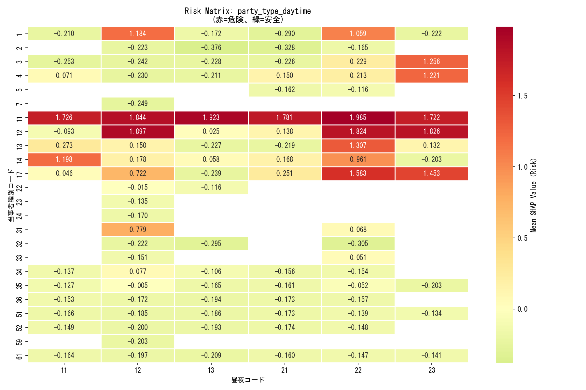
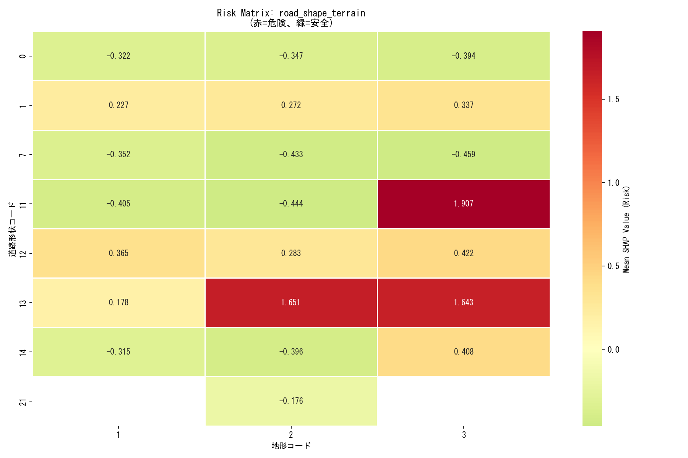
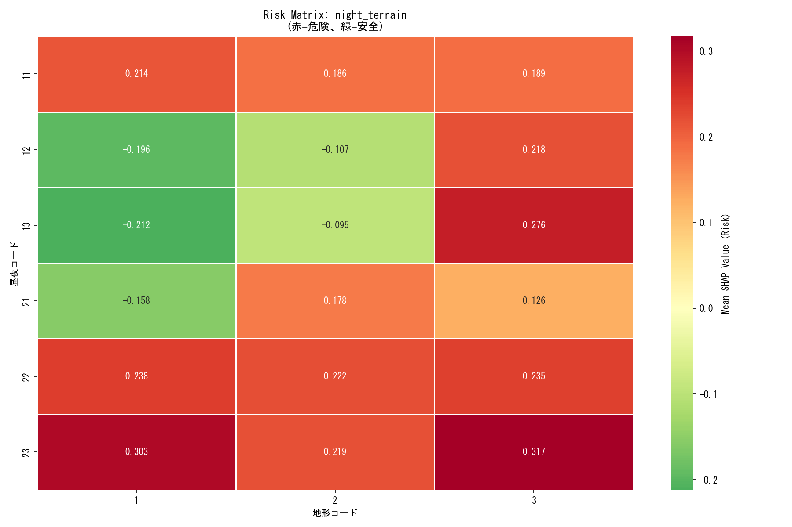
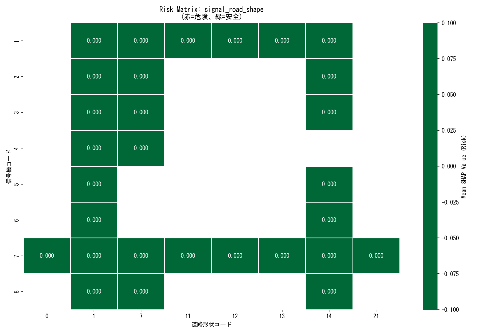
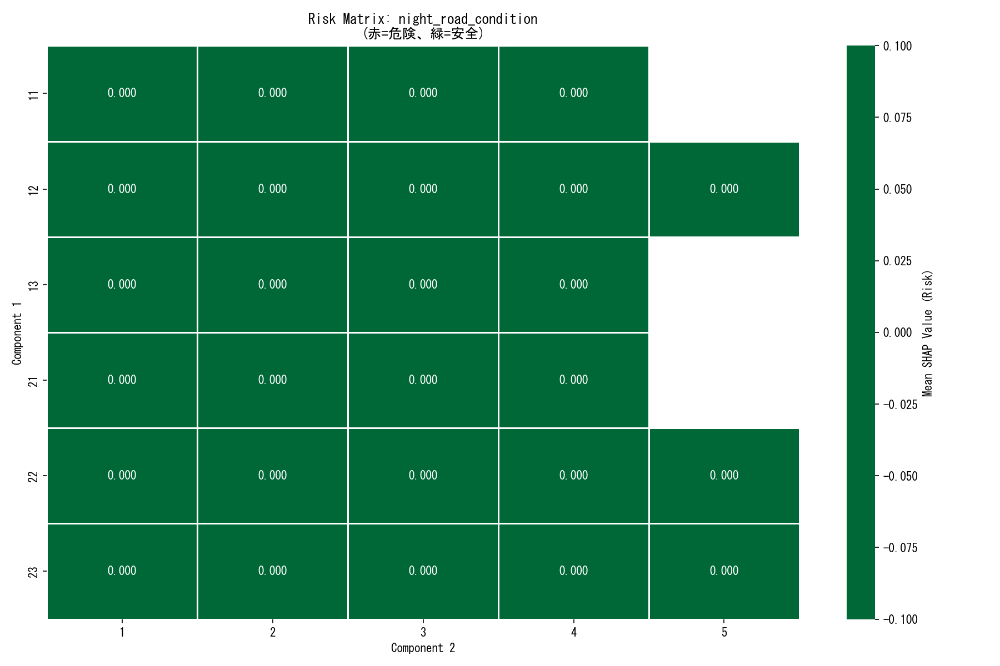
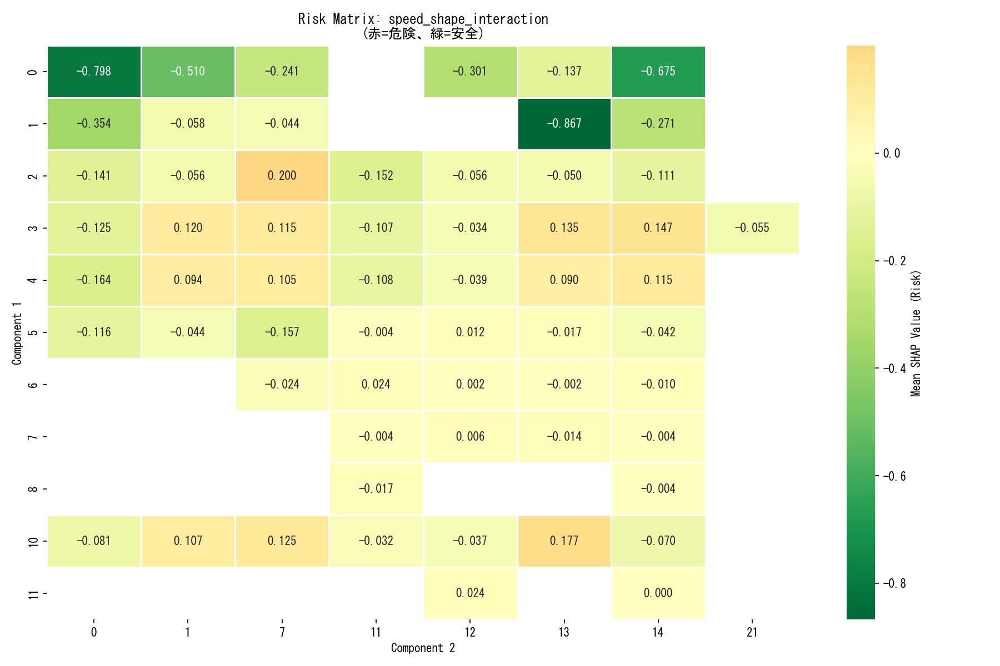

# SHAP Interaction Detail Report

## 分析対象特徴量
- party_type_daytime
- road_shape_terrain
- night_terrain
- signal_road_shape
- night_road_condition
- speed_shape_interaction

## 高リスク組み合わせ (Top 10)
| Feature | Category | Mean SHAP | Count |
| :--- | :--- | :--- | :--- |
| party_type_daytime | 11_22 | 1.9845 | 37 |
| party_type_daytime | 11_13 | 1.9226 | 6 |
| road_shape_terrain | 11_3 | 1.9066 | 18 |
| party_type_daytime | 12_12 | 1.8966 | 132 |
| party_type_daytime | 11_12 | 1.8443 | 153 |
| party_type_daytime | 12_23 | 1.8259 | 1 |
| party_type_daytime | 12_22 | 1.8244 | 20 |
| party_type_daytime | 11_21 | 1.7806 | 5 |
| party_type_daytime | 11_11 | 1.7262 | 10 |
| party_type_daytime | 11_23 | 1.7222 | 4 |

## Risk Matrix 可視化
### party_type_daytime

### road_shape_terrain

### night_terrain

### signal_road_shape

### night_road_condition

### speed_shape_interaction

