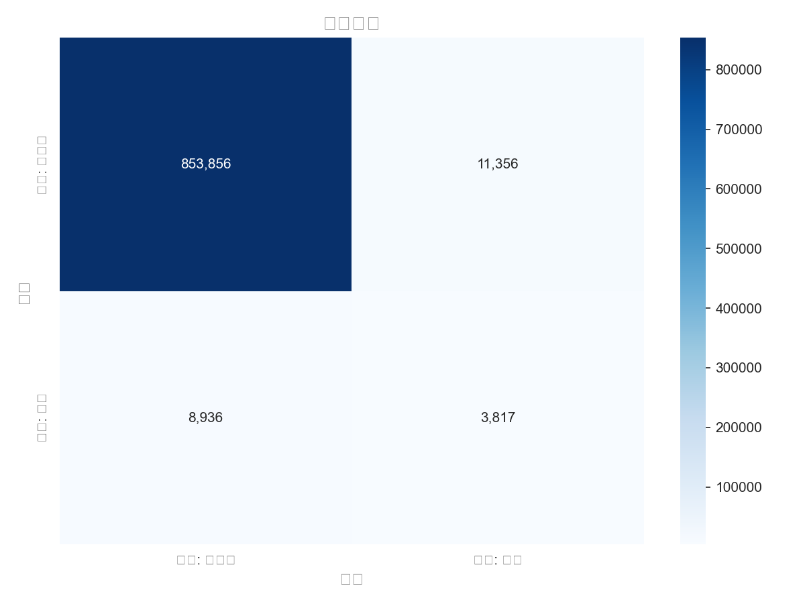
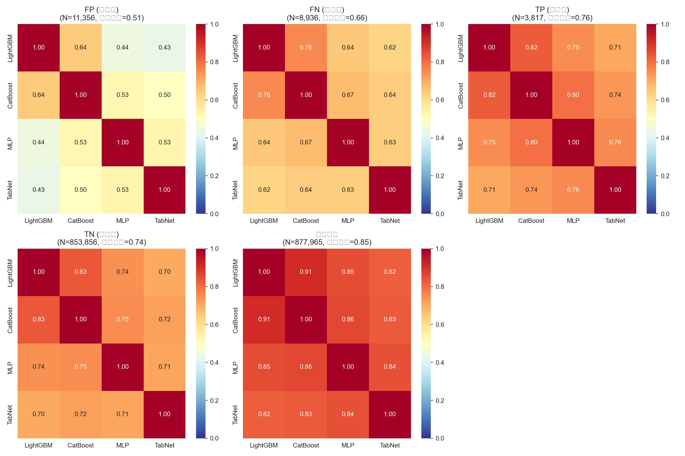
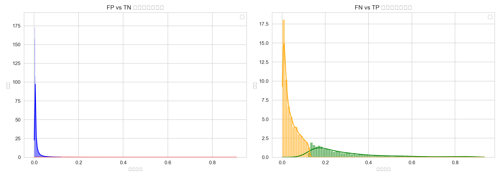
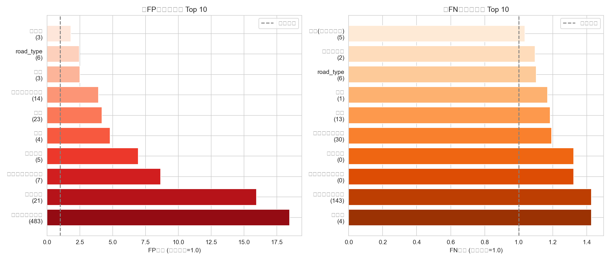
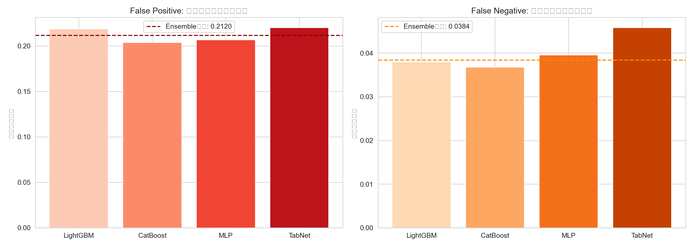

# 4モデルアンサンブル 誤差分析レポート (v3)

## 概要

この分析は、LightGBM/CatBoost/MLP/TabNetの4モデルアンサンブルにおける
予測誤りのパターンを特定し、今後のモデル改善方針を決定することを目的としています。

## 分析対象データ

- **データソース**: honhyo_for_analysis_with_traffic_hospital_no_leakage.csv
- **OOF予測数**: 877,965 件
- **最適閾値**: 0.1261 (F1スコア: 0.2734)

## 分類結果サマリー

| 分類 | 件数 | 全体比率 |
|------|------|----------|
| True Positive (正しく検出) | 3,817 | 0.43% |
| True Negative (正しく棄却) | 853,856 | 97.25% |
| **False Positive (誤検知)** | **11,356** | **1.29%** |
| **False Negative (見逃し)** | **8,936** | **1.02%** |

- **Precision**: 0.2516
- **Recall**: 0.2993
- **F1 Score**: 0.2734

## � モデル間相関分析

エラー事例におけるモデル予測値の相関を分析することで、エラーの原因を特定できます。

### False Positive (誤検知) の相関
- **平均相関係数**: 0.513
- **解釈**: 中程度の相関があり、モデル間で部分的に共通した間違いをしています。

### False Negative (見逃し) の相関
- **平均相関係数**: 0.661
- **解釈**: 中程度の相関があり、モデル間で部分的に共通した見逃しをしています。

## 📊 予測確率分布

## �🔴 高FPリスク特徴 (誤検知が多発するパターン)

| 特徴量 | カテゴリ | サンプル数 | FP率 | 全体比 |
|--------|----------|------------|------|--------|
| 市区町村コード | 483 | 104 | 0.242 | 18.5x |
| 道路形状 | 21 | 566 | 0.209 | 16.0x |
| 市区町村コード | 585 | 159 | 0.147 | 11.2x |
| 市区町村コード | 586 | 154 | 0.132 | 10.0x |
| 市区町村コード | 434 | 101 | 0.118 | 9.0x |
| 中央分離帯施設等 | 7 | 389 | 0.114 | 8.6x |
| 市区町村コード | 492 | 124 | 0.107 | 8.2x |
| 市区町村コード | 311 | 142 | 0.103 | 7.8x |
| 市区町村コード | 422 | 288 | 0.096 | 7.3x |
| 路面状態 | 5 | 1,257 | 0.091 | 6.9x |
| 市区町村コード | 370 | 101 | 0.091 | 6.9x |
| 道路形状 | 13 | 38,509 | 0.087 | 6.6x |
| 市区町村コード | 411 | 230 | 0.086 | 6.6x |
| 市区町村コード | 367 | 277 | 0.083 | 6.3x |
| 市区町村コード | 407 | 412 | 0.079 | 6.1x |

## 🟠 高FNリスク特徴 (見逃しが多発するパターン)

| 特徴量 | カテゴリ | サンプル数 | FN率 | 全体比 |
|--------|----------|------------|------|--------|

## モデル間の予測不一致

FP/FN発生時に、各モデルがどのような予測をしていたかを分析しました。

| モデル | FP時の平均予測 | FN時の平均予測 |
|--------|----------------|----------------|
| LightGBM | 0.2186 | 0.0380 |
| CatBoost | 0.2039 | 0.0368 |
| MLP | 0.2068 | 0.0395 |
| TabNet | 0.2204 | 0.0458 |

## 生成ファイル

- `confusion_matrix.png`: 混同行列ヒートマップ
- `prediction_distribution.png`: FP/FN vs TP/TNの予測確率分布
- `model_correlation.png`: エラー事例におけるモデル間相関
- `model_disagreement.png`: モデル間の予測値比較
- `feature_error_rates.png`: 特徴量別エラー率グラフ
- `false_positives_all.csv`: 全FP事例（特徴量付き）
- `false_negatives_all.csv`: 全FN事例（特徴量付き）
- `feature_error_analysis.csv`: 特徴量別エラー率の詳細

## 次のステップ (推奨)

1. **高相関エラーへの対処**: モデル間相関が高いエラーは、新しい特徴量の追加や外部データの活用で対処
2. **低相関エラーへの対処**: 特定モデルの問題は、そのモデルのハイパーパラメータ調整や特徴量選択で対処
3. **高リスク特徴への MoE**: 見逃しやすいパターンに特化したExpertモデルを追加
4. **閾値調整**: 用途に応じてRecall/Precisionのトレードオフを調整
