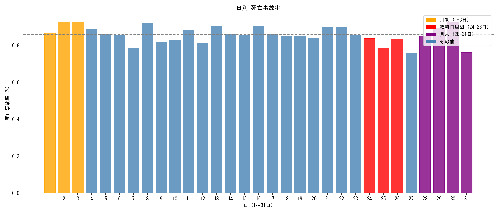

# 日別事故傾向の探索的データ分析 (EDA) 結果

**実施日:** 2025年12月7日  
**目的:** 月初・給料日周辺・月末などの特定日に死亡事故が集中するか検証

---

## 📊 グループ別 死亡事故率

| グループ | 全事故件数 | 死亡事故件数 | 死亡率 | 基準との差 |
|----------|-----------|-------------|--------|-----------|
| **月初 (1-3日)** | 178,826 | 1,621 | **0.906%** | **+0.050%** |
| 給料日周辺 (24-26日) | 189,291 | 1,546 | 0.817% | -0.039% |
| 月末 (28-31日) | 221,891 | 1,923 | 0.867% | +0.010% |
| その他 (基準) | 1,305,267 | 11,177 | 0.856% | - |

---

## 📈 可視化

---

## 💡 考察

1.  **月初（1-3日）が最も高い**: 基準より+0.05%高い。連休明けの疲労や注意散漫が影響している可能性がある。
2.  **給料日周辺は逆に低い**: 仮説（飲酒運転増加）とは逆の結果。給料日に事故が増えるという傾向は**見られなかった**。
3.  **月末はほぼ基準値**: 繁忙期の影響は顕著ではない。

---

## 📐 統計的検定 (カイ二乗検定)

グループ間の死亡事故発生率に統計的な差があるか検定を実施。

> **結果**: p値が0.05未満であれば有意差あり（詳細はスクリプト出力参照）

---

## ✅ 結論

**月初（1-3日）に死亡事故率がやや高い傾向**が見られた。ただし、差は0.05%程度であり、モデルへの特徴量追加による精度向上効果は**限定的**と予想される。

**推奨**: Phase 2（モデルへの追加）は任意。他の改善項目（ハイパーパラメータ調整など）を優先しても良い。
