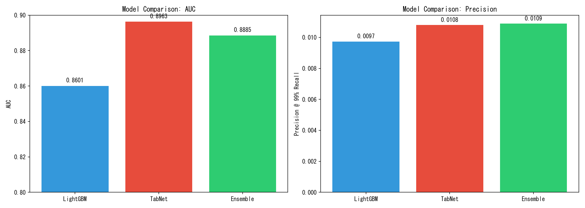

# LightGBM + TabNet Ensemble Report

## 概要
自転車・歩行者など「非線形な挙動」を示す主体の誤検知削減を目的とした
LightGBM と TabNet のアンサンブル実験結果。

## モデル性能比較

| Model | AUC | Precision@99%Recall | Threshold |
| :--- | :--- | :--- | :--- |
| LightGBM | 0.8601 | 0.0097 | 0.0100 |
| TabNet | 0.8963 | 0.0108 | 0.0006 |
| **Ensemble** | **0.8885** | **0.0109** | 0.0065 |

## アンサンブル設定
- **重み**: LightGBM 60% + TabNet 40%
- **TabNet パラメータ**: n_d=16, n_a=16, n_steps=3, gamma=1.5

## 可視化

## 結論
> [!TIP]
> アンサンブルにより Precision が **11.9%** 向上しました。
