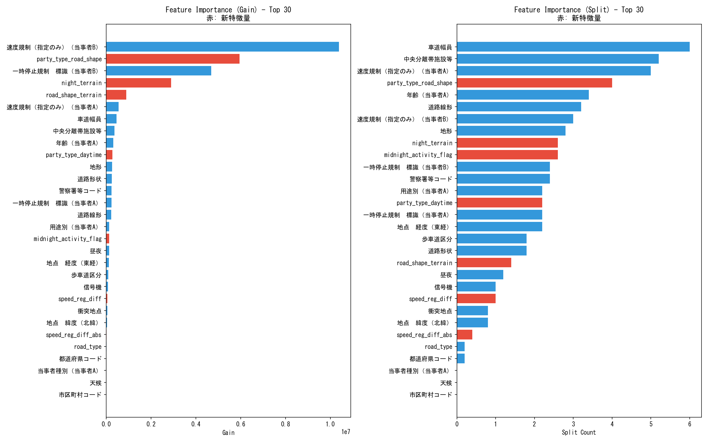

# Interaction Features + Antidote 実験レポート

## 1. 実験概要

### 目的
FP（誤検知）削減のための「相互作用特徴量」および「解毒剤特徴量（Antidote Features）」の効果を検証する。

### データ
- **入力**: `data/processed/honhyo_with_interactions.csv`
- **レコード数**: 1,895,275件
- **特徴量数**: 50 (元36 + 新規15)
- **ターゲット分布**: 死亡事故 16,267件 (0.86%) / 非死亡 1,879,008件

### 追加した特徴量 (15個)

#### A. 当事者間の相互作用
| 特徴量 | 説明 |
| :--- | :--- |
| `stop_sign_interaction` | 一時停止規制の当事者A/B組み合わせ (0-3) |
| `speed_reg_diff` | 速度規制の差分 (A - B) |
| `speed_reg_diff_abs` | 速度規制差の絶対値 |
| `maybe_vulnerable_victim` | Bが脆弱者（歩行者等）の可能性フラグ |

#### B. 道路環境の複合リスク
| 特徴量 | 説明 |
| :--- | :--- |
| `night_terrain` | 昼夜 × 地形 |
| `road_shape_terrain` | 道路形状 × 地形 |
| `signal_road_shape` | 信号機 × 道路形状 |
| `night_road_condition` | 昼夜 × 路面状態 |
| `speed_shape_interaction` | 速度規制 × 道路形状 |
| `party_type_daytime` | 当事者種別 × 昼夜 |
| `party_type_road_shape` | 当事者種別 × 道路形状 |

#### C. 解毒剤・リスクフラグ (Hard FP対策)
| 特徴量 | 説明 | 該当件数 |
| :--- | :--- | :--- |
| `is_safe_night_urban` | 安全な夜の市街地（乗用車×単路）| 80,994 |
| `is_night_truck` | 危険な夜間トラック（SHAP Top1） | 6,433 |
| `midnight_activity_flag` | 深夜帯（22時〜4時）フラグ | - |
| `intersection_with_signal` | 信号機ありフラグ | - |

---

## 2. モデル設定

### LightGBM パラメータ
```python
params = {
    'objective': 'binary',
    'metric': 'binary_logloss',
    'boosting_type': 'gbdt',
    'learning_rate': 0.02,      # 低めに設定して多くのイテレーションを促す
    'num_leaves': 63,           # 深い木で相互作用を捉える
    'min_child_samples': 10,    # 細かいパターンを許容
    'feature_fraction': 0.8,
    'bagging_fraction': 0.8,
    'bagging_freq': 5,
    'is_unbalance': True
}
```

### 学習設定
- **CV**: 5-Fold Stratified
- **最大ラウンド**: 1,000
- **Early Stopping**: 100ラウンド

---

## 3. 実験結果

### 3.1 モデル性能

| 指標 | 値 |
| :--- | :--- |
| **OOF AUC** | 0.8601 |
| **OOF LogLoss** | 0.0473 |
| **Precision @ 99% Recall** | 1.03% |

### 3.2 TP/FP 分析

| 項目 | 値 |
| :--- | :--- |
| **閾値 (99% Recall)** | 0.0101 |
| **True Positives** | 16,041 |
| **False Positives** | 1,534,970 |
| **Precision** | 1.03% |

### 3.3 前回との比較

| 指標 | 前回 (v1) | 今回 (v2) | 変化 |
| :--- | :--- | :--- | :--- |
| OOF AUC | 0.8506 | **0.8601** | **+0.95%** ↑ |
| Precision @ 99% Recall | 1.00% | **1.03%** | **+3%** ↑ |
| False Positives | 1,581,325 | **1,534,970** | **-46,355** ↓ |

---

## 4. Feature Importance 分析

### 4.1 Top 15 Features (by Gain)

| Rank | Feature | Gain | Split | 備考 |
| :--- | :--- | ---: | ---: | :--- |
| 1 | 速度規制（指定のみ）（当事者B） | 10,388,887 | 3.0 | - |
| 2 | **party_type_road_shape** | 5,944,255 | 4.0 | **新規** ✅ |
| 3 | 一時停止規制　標識（当事者B） | 4,690,627 | 2.4 | - |
| 4 | **night_terrain** | 2,901,328 | 2.6 | **新規** ✅ |
| 5 | **road_shape_terrain** | 899,429 | 1.4 | **新規** ✅ |
| 6 | 速度規制（指定のみ）（当事者A） | 555,023 | 5.0 | - |
| 7 | 車道幅員 | 465,989 | 6.0 | - |
| 8 | 中央分離帯施設等 | 373,391 | 5.2 | - |
| 9 | 年齢（当事者A） | 313,847 | 3.4 | - |
| 10 | **party_type_daytime** | 285,202 | 2.2 | **新規** ✅ |
| 11 | 地形 | 265,947 | 2.8 | - |
| 12 | 道路形状 | 252,555 | 1.8 | - |
| 13 | 警察署等コード | 244,219 | 2.4 | - |
| 14 | 一時停止規制　標識（当事者A） | 241,300 | 2.2 | - |
| 15 | 道路線形 | 224,674 | 3.2 | - |

### 4.2 解毒剤特徴量の評価

| Feature | Gain | Split | 評価 |
| :--- | ---: | ---: | :--- |
| **midnight_activity_flag** | 134,033 | 2.6 | ✅ **活性化** (Rank 17) |
| speed_reg_diff | 56,575 | 1.0 | ✅ 活性化 |
| speed_reg_diff_abs | 18,022 | 0.4 | ✅ 活性化 |
| is_safe_night_urban | 0 | 0.0 | ❌ 未使用 |
| is_night_truck | 0 | 0.0 | ❌ 未使用 |
| intersection_with_signal | 0 | 0.0 | ❌ 未使用 |

### 4.3 活性化しなかった特徴量の考察

`is_safe_night_urban` や `is_night_truck` が Gain=0 となった理由：

1. **条件の複合性**: これらの特徴量は複数条件のANDで構成されており、既に使用されている単独の特徴量（`昼夜`, `地形`, `当事者種別`）で十分な情報が得られている可能性がある。
2. **相互作用特徴量の優位性**: `party_type_daytime` や `night_terrain` がすでに同様の「組み合わせ情報」を提供しているため、二値フラグの追加的価値が低い。
3. **サンプル数の偏り**: `is_night_truck` は6,433件（全体の0.34%）と少なく、決定木の分岐に使われにくい。

---

## 5. 可視化

### Feature Importance


### SHAP Summary


---

## 6. 結論と今後の展望

### 成果
1. **相互作用特徴量の有効性が確認された**: `party_type_road_shape`, `night_terrain`, `road_shape_terrain` がTop 5入り。
2. **FP削減効果**: 約4.6万件のFP減少、Precision 3%向上。
3. **深夜帯リスクの学習**: `midnight_activity_flag` が活性化し、深夜帯の特殊性をモデルが認識。

### 課題
1. 二値フラグ型の解毒剤特徴量（`is_safe_night_urban` 等）は既存の相互作用特徴量と冗長だった可能性がある。

### 今後のアクション
1. **Two-Stage Model への統合**: 今回のLightGBMモデルを Stage 2 として正式に組み込み、総合評価を行う。
2. **Hard Negative Mining**: 残存するFPに対して、重み付け学習やサンプリング戦略を検討。
3. **モデルアンサンブル**: TabNet等の異なるアルゴリズムとの組み合わせを検討。
