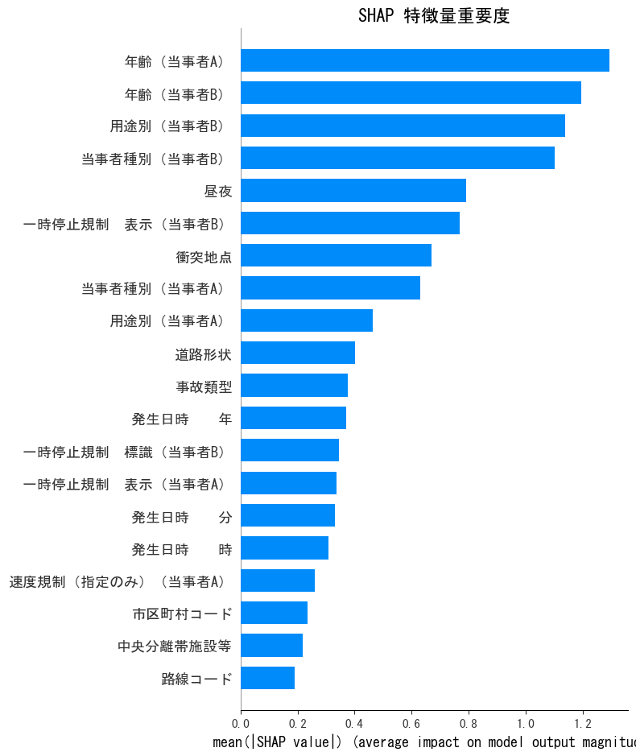
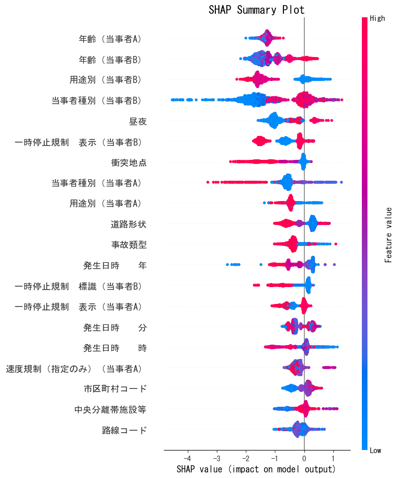
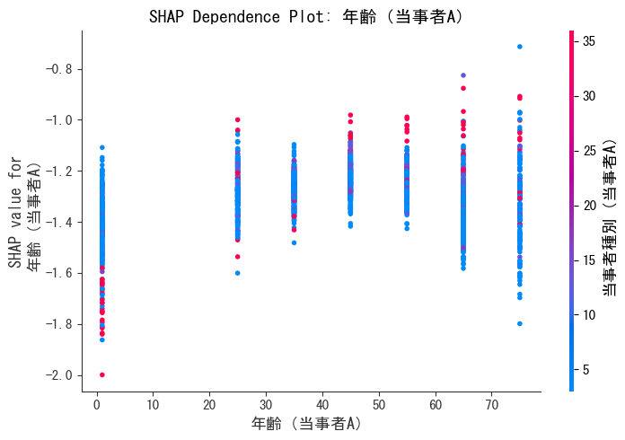
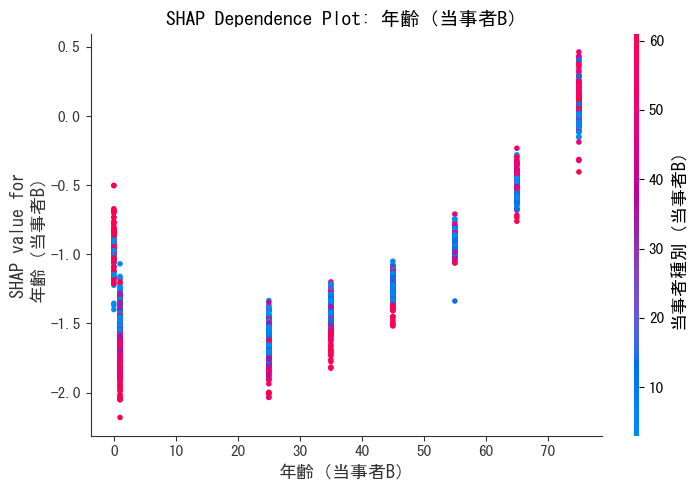
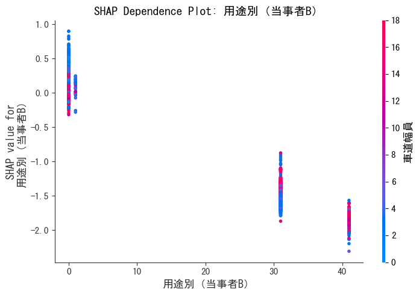

# SHAP分析によるモデル解釈レポート

**分析日時:** 2025年12月4日  
**対象モデル:** LightGBM + SMOTE (事前情報のみ使用)

---

## 📊 分析概要

LightGBMモデルが「なぜその事故を危険（死亡事故リスクあり）と判断したのか」を、SHAP (SHapley Additive exPlanations) を用いて可視化しました。

### 主要な発見
モデルは以下の要素を最重要視しています：
1. **年齢（当事者A・B）**: 高齢者かどうか
2. **用途別（当事者B）**: 相手が歩行者か、大型車か、など
3. **時間帯**: 発生時刻

---

## 🔍 詳細分析

### 1. 特徴量重要度 (Summary Plot)

モデルの予測に最も寄与した特徴量のランキングです。

- **年齢（当事者A, B）**が圧倒的に重要度が高いことが分かります。
- 次いで**用途別（当事者B）**、**発生日時（時）**が続きます。

### 2. 影響の方向性 (Summary Plot - Dot)

各特徴量の値が予測を「死亡事故（プラス方向）」に動かしたか、「非死亡（マイナス方向）」に動かしたかを示します。

- **赤色**が高い値、**青色**が低い値を示します。
- **年齢**: 赤色（高齢）が右側（死亡リスク増）に分布しています。つまり、「高齢であるほど死亡リスクが高い」とモデルは判断しています。

### 3. 個別特徴量の分析 (Dependence Plot)

#### 年齢（当事者A）

- 年齢が上がるにつれてSHAP値（リスク）が上昇する傾向が見て取れます。

#### 年齢（当事者B）

- 相手側の年齢も同様に、高齢になるほどリスク要因として判断されています。

#### 用途別（当事者B）

- 特定の用途（カテゴリ値）においてリスクが跳ね上がるポイントが存在します（歩行者や自転車などが該当すると推測されます）。

---

## 💡 結論

SHAP分析により、このモデルはブラックボックスではなく、**「高齢者」や「特定の相手（歩行者等）」、「時間帯」といった納得感のあるリスク要因**に基づいて判断していることが確認できました。

これは、モデルが単なるデータの丸暗記ではなく、交通安全上の**本質的な危険パターン**を学習できていることを示唆しています。
