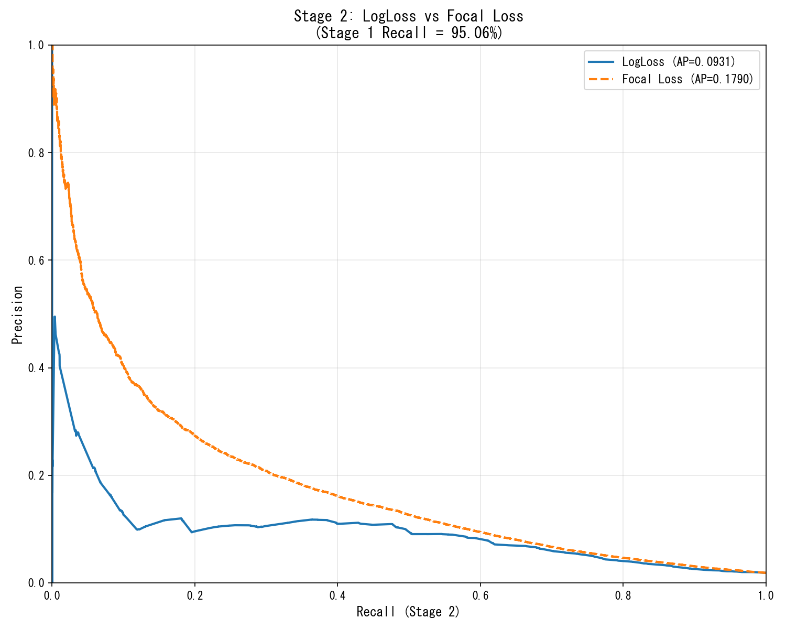

# Stage 2 損失関数比較実験レポート

**実行日時**: 2025-12-18 18:12:50
**実行時間**: 159.5秒

## 実験設定

| 項目 | 値 |
|------|----| 
| Stage 1 Target Recall | 95% |
| Stage 1 Actual Recall | 95.06% |
| Stage 1 フィルタリング率 | 56.32% |
| Focal Loss α | 0.6321 |
| Focal Loss γ | 1.1495 |

## Stage 2 結果 (CV OOF)

| モデル | AUC | Average Precision |
|--------|-----|-------------------|
| LogLoss | 0.7959 | 0.0931 |
| Focal Loss | 0.8268 | 0.1790 |

## Precision @ Recall テーブル

     Model Stage2_Recall_Target Stage2_Recall_Actual Total_Recall Precision Threshold
   LogLoss                  99%               99.12%       94.22%    0.0193    0.0240
Focal Loss                  99%               99.10%       94.21%    0.0195    0.0690
   LogLoss                  95%               95.86%       91.12%    0.0210    0.0310
Focal Loss                  95%               95.13%       90.43%    0.0240    0.0850
   LogLoss                  90%               91.00%       86.51%    0.0248    0.0400
Focal Loss                  90%               90.27%       85.81%    0.0304    0.1010
   LogLoss                  85%               85.03%       80.83%    0.0337    0.0620
Focal Loss                  85%               85.18%       80.97%    0.0385    0.1200
   LogLoss                  80%               81.02%       77.02%    0.0395    0.0790
Focal Loss                  80%               80.25%       76.29%    0.0461    0.1350

## PR曲線

## 考察

- Stage 1 Recall = 95.06% により、56.32% のデータを除外。
- Stage 2 での LogLoss vs Focal Loss を比較。
- Average Precision (AP) は PR曲線の下面積であり、全体的な性能を表す。
- 高Recall領域での Precision に注目してモデルを選択する。
