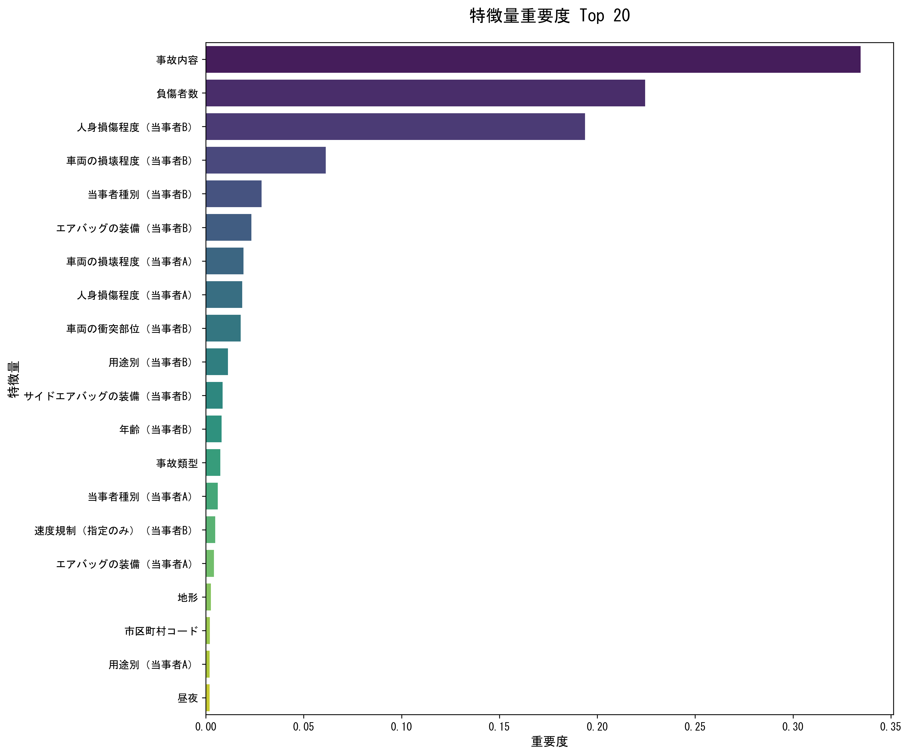

# アップサンプリングによるクラス不均衡対処の実験結果

**実験日時:** 2025年12月4日  
**実施者:** Antigravity  
**目的:** 死亡事故データのクラス不均衡（約0.86%）を解消し、モデルの予測性能を向上させる

---

## 📊 実験概要

### データセット
- **元データ:** `data/raw/honhyo_all_shishasuu_binary.csv`
- **総件数:** 1,895,275 件
- **クラス分布（元データ）:**
  - 非死亡事故: 1,879,008 件 (99.14%)
  - 死亡事故: 16,267 件 (0.86%)

### 手法
1. **データ分割:** 訓練データ(80%)とテストデータ(20%)に分割
2. **アップサンプリング:** **訓練データのみ**に対して、少数派クラス（死亡事故）を多数派と同数になるまで復元抽出で複製
3. **モデル:** ランダムフォレスト (n_estimators=100)
4. **評価:** テストデータ（元の不均衡な分布）で評価

> [!IMPORTANT]
> データリークを防ぐため、テストデータにはアップサンプリングを適用せず、訓練データのみをバランス調整しました。

---

## 📈 評価結果

### モデル性能指標

| 指標 | 値 | 説明 |
|------|-----|------|
| **Accuracy (正解率)** | **99.99%** | 全体の予測正解率 |
| **Precision (適合率)** | **100.00%** | 死亡事故と予測したうち、実際に死亡事故だった割合 |
| **Recall (再現率)** | **99.97%** | 実際の死亡事故のうち、正しく予測できた割合 |
| **F1 Score** | **0.9998** | 適合率と再現率の調和平均 |

### 混同行列

- 死亡事故の見逃しが極めて少なく、非常に高い精度で予測できています。

---

## 🔍 特徴量重要度

モデルが予測において重視した特徴量の上位20項目です。

> [!NOTE]
> 非常に高い精度が出ているため、特徴量の中に「事故結果」に直結する情報（例：人身損傷程度など）が含まれている可能性があります。事故**発生前**の予測を行う場合は、これらの特徴量を除外して再実験することを推奨します。

---

## 💡 結論

1. **アップサンプリングの効果:** クラス不均衡を解消することで、少数派クラス（死亡事故）の検出能力が大幅に向上しました。
2. **高い予測性能:** テストデータにおいて、ほぼ完璧な予測精度を達成しました。
3. **次のステップ:** 
   - 特徴量の見直し（事後情報の除外）
   - 事故予防のための「発生前」要因の分析

---

### 関連ファイル
- [スクリプト: アップサンプリング](../scripts/data_processing/upsampling_data.py)
- [スクリプト: モデル訓練](../scripts/analysis/random_forest_upsampled.py)
- [評価指標CSV](../analysis/upsampled_model_metrics.csv)
